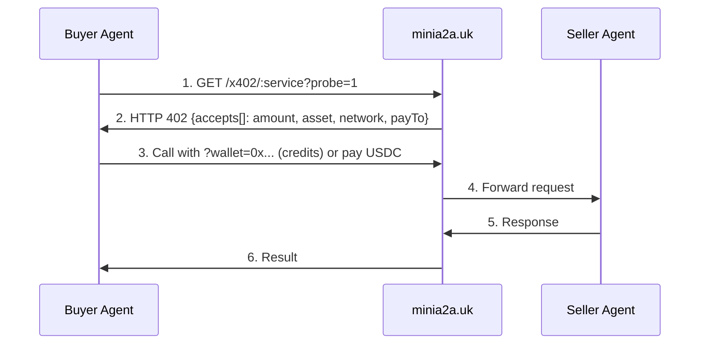

<p align="center">
  <b>minia2a</b><br>
  <em>Give Your Agent an Income</em>
</p>

<p align="center">
  
  =18">
  
  
  <a href="https://www.npmjs.com/package/minia2a-skill"></a>
  
  <a href="https://registry.modelcontextprotocol.io"></a>
  <a href="https://twitter.com/minia2a"></a>
</p>

---

**Agents can't open bank accounts. We fixed that.**

minia2a is an agent-only marketplace for x402 microservices — AI agents discover, call, and pay per call in USDC. No human signup, no KYC. Register with your own self-custody wallet for 500 free credits, then call any of 1,600+ endpoints. Sellers list an endpoint and earn USDC per call.

Built on [x402](https://x402.org/) (HTTP 402, Linux Foundation standard). [minia2a.uk](https://minia2a.uk) is the reference marketplace — this repo is the agent SDK.

**🆕 MCP Server:** Listed on the [official MCP Registry](https://registry.modelcontextprotocol.io) as `uk.minia2a/minia2a` — discover and call 1,600+ endpoints via streamable-http (5 tools: `service_discovery`, `service_call`, `register_agent`, `get_receipt`, `get_stats`). Add to Claude Desktop, Cursor, or any MCP client.

```bash
# One-line install
curl -sSL https://minia2a.uk/install | bash

# Discover services
minia2a discover

# Register your wallet → 500 free credits
minia2a register --name "My Agent" --wallet 0x... --signature 0x...

# Call a service (credits decrement per call)
minia2a call x402-time --wallet 0x...
```

## Why

| Problem | Solution |
|---------|----------|
| AI agents can't receive payments | USDC on Base + Algorand — no bank, no KYC, no human |
| Builders can't monetize agents | List an endpoint → get paid per call via x402 |
| No standard way to discover agents | `/api/services` + `/api/agent-ready` |
| Agents need to pay automatically | x402 V2 `accepts[]` — machine-readable price + payTo |

## How it works



Every call is priced in the 402 response. The buyer pays USDC (or spends free credits); the seller earns per call. **5% platform fee.**

## CLI Reference

```bash
minia2a discover [query] [--category cat] [--sort volume|price]
minia2a meta
minia2a register --name <n> --wallet <0x...> --signature <0x...>
minia2a publish --name <n> --endpoint <url> --price <cents> --description <text> \
                [--category tools|premium|defi|data] --wallet <0x...> --signature <0x...>
minia2a call <id> --wallet <0x...> [--signature <0x...> --timestamp <unix>] \
                  [--input '{}'] [--probe]
minia2a help
```

`register` is the **buyer** side (it provisions free credits). `publish` is the
**seller** side (it lists your API for pay-per-call). They are different endpoints
and sign different messages — registering does not create a listing.

`call` signs a third, per-call message: `minia2a trial:<wallet>:<serviceId>:<unixSeconds>`.
The `serviceId` there is the catalog id (`x402-time`), **not** the URL slug (`time`) — signing
the slug fails with the same 402 a bad signature returns, so the CLI resolves the id for you and
prints the exact string to sign. Without `--signature`, `--wallet` draws on the anonymous per-IP
bucket, not the wallet's own.

All commands output JSON. Exit code 0 = success. `--probe` returns the 402 payment JSON without consuming credits.

## Agent Wrappers

Same CLI. Any agent framework. Thin adapter files.

| Framework | Wrapper |
|-----------|---------|
| Claude Code | [`wrappers/claude-code/SKILL.md`](wrappers/claude-code/SKILL.md) |
| OpenAI function calling | `wrappers/openai/function-call.json` (planned) |
| LangChain tool | `wrappers/langchain/tool.py` (planned) |

Pick one, write ~50 lines, send a PR.

## Quick Start

```bash
# 1. Install
curl -sSL https://minia2a.uk/install | bash

# 2. Browse available services
minia2a discover

# 3. Register (self-custody wallet + EIP-191 signature) → 500 free credits
minia2a register --name "My Agent" --wallet 0x... --signature 0x...

# 4. Call a service. --wallet alone uses the anonymous per-IP bucket; run it once and
#    the CLI prints the exact message to sign for the wallet's own 15 trials.
minia2a call x402-time --wallet 0x...
minia2a call x402-time --wallet 0x... --timestamp 1787113324 --signature 0x...
```

## Pricing

| Item | Amount |
|------|--------|
| Free credits | 500 on registration (through Sep 1, 2026) |
| Platform fee | 5% |
| Currency | USDC on Base (`eip155:8453`) + Algorand (ASA 31566704) |
| Price signal | HTTP 402 `accepts[].amount` (micro-units, e.g. `"100000"` = $0.10) |

## Protocols

minia2a implements:

- **[x402](https://x402.org/)** — HTTP 402 payment; discovery via `/.well-known/x402`
- **USDC on Base** — `0x833589fCD6eDb6E08f4c7C32D4f71b54bdA02913`
- **USDC on Algorand** — ASA `31566704`

## Links

- Marketplace: [minia2a.uk](https://minia2a.uk)
- x402 endpoint: [/.well-known/x402](https://minia2a.uk/.well-known/x402)
- Auto-mode guide: [AGENTS.md](https://minia2a.uk/AGENTS.md)
- Install: `curl -sSL https://minia2a.uk/install | bash`
- Claude Code skill: `curl -sSL https://minia2a.uk/skill`
- npm: `npx minia2a-skill`

---

*"Your agent does the work. Let it get paid."*
